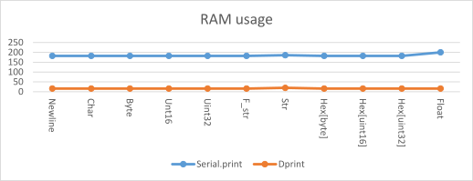
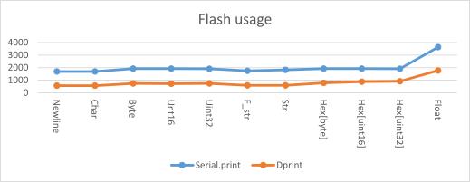

# SearchAThing.Arduino.Utils

Just to modularize some aspect of the software built with Arduino I developed this simple library that contains in summary the following:

| topic | description |
|---|---|
| [DPrint](#DPrint) | Function to print through the serial or other devices without to use Serial.print ( to save some bytes on the flash ) |
| TimeDiff | A function that help to compute the time difference managing uint32 overflow |
| FreeMemory | Functions to retrieve free memory ( fragmented and contiguos ) |
| BufferInfo | Just a container for a dynamic pointer with its size ( without memory management ) |
| IdStorage | Compact set of ids |
| SList | A templated simple linked list |
| RamData | A container of bytes, but can be used for strings too, that allocate and deallocate memory dynamically with some useful functions such as string comparision, word splitting, etc |
| BufWrite/Read | Read/Write uint16 and uint32 from and to a bytes buffer using MSB order |

> For a technical documentation of the API please refer to the documentation contained inside the source code header files accessible through the IDE intellisense.

## Source code

To instal the library just clone [this git repository](https://github.com/devel0/SearchAThing.Arduino.Utils) into your Documents/Arduino/libraries folder.

## DPrint

### Introduction

The need for a dprint routine come to me todo some hex formatting of 16bit and 32bit values with arbitrary byte order and to reduce the size of the flash used by removing the usage of the Serial and vsnprintf references. Here some comparision of the flash / ram program size ( bytes )





In short using DPrint about 1K flash and 200 bytes of RAM can be saved that for an atmega328 are ~3% of the Flash and ~10% RAM.

### Test conditions

- print without newlines ( Serial.print, DPrint )
- print string with sample "HI"
- cast over argument types ( eg. DPrint((uint16_t)1); )

### Example

```c++
// Copyright(c) 2016 Lorenzo Delana, https://searchathing.com, License under MIT

//===========================================================================
// EXAMPLE	: ex01-dprint.ino
//===========================================================================
// Setup()
//   - Print some data using the speed as defined by the SERIAL_SPEED macro
// Loop()
//---------------------------------------------------------------------------
// Suggested defines for this example
//---------------------------------------------------------------------------
// SEARCHATHING_DISABLE;DPRINT_SERIAL;SERIAL_SPEED=9600
//

// SearchAThing.Arduino debug macro definitions
#include <SearchAThing.Arduino.Utils\DebugMacros.h>

//---------------------------------------------------------------------------
// Libraries
//---------------------------------------------------------------------------
#include <SearchAThing.Arduino.Utils\Util.h>
using namespace SearchAThing::Arduino;

//---------------------------------------------------------------------------
// Setup
//---------------------------------------------------------------------------
void setup()
{
  // Note : DPrint serial begin automatic using speed from the macro
  //        SERIAL_SPEED

  auto r = 5.60;

  DPrint(F("Circle r=")); DPrint((float)r);
  DPrint(F(" C=")); DPrint((float)(2 * r * PI));
  DPrint(F(" A=")); DPrint((float)(r * r * PI));
}

//---------------------------------------------------------------------------
// Loop
//---------------------------------------------------------------------------
void loop()
{
}
```

## TimeDiff

### Introduction

When arduino power-up its *millis()* value is 0 and this increase until its overflow. Being that is a 32bit unsigned integer it can store up to 2^32 milliseconds before the overflow, then 2^32/1e3/60/60/24 = ~49.7 days. To measure a time interval we need two references ( a start time, a current time ). The TimeDiff function based on the fact that start time is supposed to be taken for the real before than the current time, so in general our time difference will simply (current time - start time) with the exception that if the start time is greater than the current time this mean that we have to consider the wrap around caused by the overflow and adjust our difference as (ULONG_MAX - start_time) + current_time + 1. 

### Example

```c++
// Copyright(c) 2016 Lorenzo Delana, https://searchathing.com, License under MIT

//===========================================================================
// EXAMPLE	: ex02-timediff.ino
//===========================================================================
// Setup()
//   - Basic usage of TimeDiff.
// Loop()
//---------------------------------------------------------------------------
// Suggested defines for this example
//---------------------------------------------------------------------------
// SEARCHATHING_DISABLE;DPRINT_SERIAL;SERIAL_SPEED=9600
//

// SearchAThing.Arduino debug macro definitions
#include <SearchAThing.Arduino.Utils\DebugMacros.h>

//---------------------------------------------------------------------------
// Libraries
//---------------------------------------------------------------------------
#include <SearchAThing.Arduino.Utils\Util.h>
using namespace SearchAThing::Arduino;

//---------------------------------------------------------------------------
// Setup
//---------------------------------------------------------------------------
void setup()
{
  DPrintln("Computing time diff, wait 1 sec");

  auto begin = millis();

  delay(1000);

  DPrint("Time diff:"); DPrintln(TimeDiff(begin, millis()));
}

//---------------------------------------------------------------------------
// Loop
//---------------------------------------------------------------------------
void loop()
{

}
```

## FreeMemory

### Introduction

For details about how Arduino memory are organized consult these links ( [1](http://jeelabs.org/2011/05/22/atmega-memory-use/index.html) [2](http://www.avr-developers.com/mm/memoryusage.html) [3](http://www.nongnu.org/avr-libc/user-manual/malloc.html) ). These functions are used for debug purpose.

### Example

```c++
// Copyright(c) 2016 Lorenzo Delana, https://searchathing.com, License under MIT

//===========================================================================
// EXAMPLE    : ex03-freememory.ino
//===========================================================================
// Setup()
//   - Print summary of free memory (max contiguous allocable block and sum
//     of all fragmented available memory).
//   - Print detailed memory layout.
// Loop()
//---------------------------------------------------------------------------
// Suggested defines for this example
//---------------------------------------------------------------------------
// SEARCHATHING_DISABLE;DPRINT_SERIAL;SERIAL_SPEED=9600
//

// SearchAThing.Arduino debug macro definitions
#include <SearchAThing.Arduino.Utils\DebugMacros.h>

//---------------------------------------------------------------------------
// Libraries
//---------------------------------------------------------------------------
#include <SearchAThing.Arduino.Utils\Util.h>
#include <MemoryFree\MemoryFree.h> // needed for FreeMemorySum()
using namespace SearchAThing::Arduino;

//---------------------------------------------------------------------------
// Setup
//---------------------------------------------------------------------------
void setup()
{
    auto a = (byte *)malloc(10);
    auto b = (byte *)malloc(20);
    free(a);

    PrintFreeMemory();

    PrintRAMLayout();

    DPrint("a="); DPrintHexln((size_t)a);
    DPrint("b="); DPrintHexln((size_t)b);
}

//---------------------------------------------------------------------------
// Loop
//---------------------------------------------------------------------------
void loop()
{

}

```

### Expected output

On an Arduino Nano V3 ( atmega328 ) : 

```
free blk=1760 frg=1930
RAM LAYOUT
--------------------
__malloc_margin		128

__data_start		0x0100
__data_end		0x0112

__bss_start		0x0112
__bss_end		0x0120

__malloc_heap_start	0x0120
__heap_start		0x0120
__brkval		0x018c
SP - __malloc_margin	0x086a

SP			0x08ea
myCurStack		0x08eb
RAMEND			0x08ff

FREE LIST
--------------------
__flp			0x0120

fp=0x0120 sz=10 nx=0x0142
fp=0x0142 sz=30 nx=0x0000
a=0122
b=012e
c=0144
d=0164
```

### Description

| section | description |
|---|---|
| data | global and static variables with initializer value |
| bss | global and static variables uninitialized |
| heap | runtime dynamic memory allocation |
| stack | function variables |

Data and BSS sections are computed at compile time while the heap and stack competing for the space between `_malloc_heap_start` and RAMEND. 
- heap starts from the `_malloc_heap_start` and grows 
  - free list `__flp` pointer points to the head of a simple linked list which data is a number that states the size of the release memory available for further allocations.
- stack starts from the `RAMEND` and grows backward 
  - the stack pointer SP refer to the last allocated stack variable

The `__malloc_margin` is a safety margin between the space ussed by the heap and the stack. 
