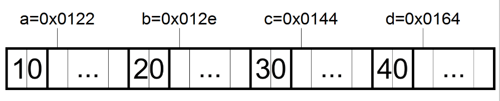
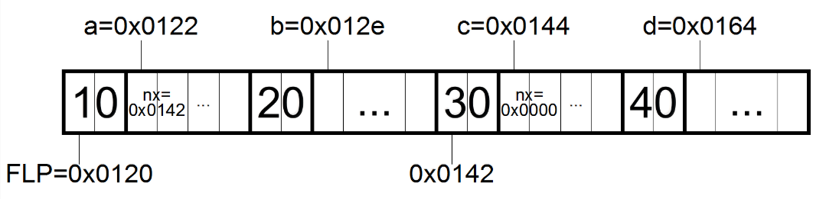
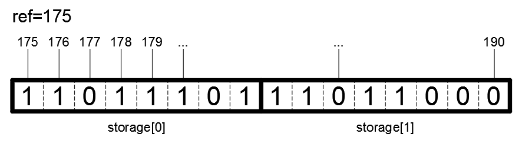

# SearchAThing.Arduino.Utils

Just to modularize some aspect of the software built with Arduino I developed this simple library that contains in summary the following:

| topic | description |
|---|---|
| [DPrint](#dprint) | Function to print through the serial or other devices without to use Serial.print ( to save some bytes on the flash ) |
| [TimeDiff](#timediff) | A function that help to compute the time difference managing uint32 overflow |
| [FreeMemory](#freememory) | Functions to retrieve free memory ( fragmented and contiguos ) |
| [BufferInfo](#bufferinfo) | Just a container for a dynamic pointer with its size ( without memory management ) |
| [IdStorage](#idstorage) | Compact set of ids |
| [SList](#slist) | A templated simple linked list |
| [RamData](#ramdata) | A container of bytes, but can be used for strings too, that allocate and deallocate memory dynamically with some useful functions such as string comparision, word splitting, etc |
| [BufWrite/Read](#bufwriteread) | Read/Write uint16 and uint32 from and to a bytes buffer using MSB order |

> For a technical documentation of the API please refer to the documentation contained inside the source code header files accessible through the IDE intellisense.

## Source code

To instal the library just clone [this git repository](https://github.com/devel0/SearchAThing.Arduino.Utils) into your Documents/Arduino/libraries folder.

## DPrint

### Introduction

The need for a dprint routine come to me todo some hex formatting of 16bit and 32bit values with arbitrary byte order and to reduce the size of the flash used by removing the usage of the Serial and vsnprintf references. Here some comparision of the flash / ram program size ( bytes )


In short using DPrint about 1K flash and 200 bytes of RAM can be saved that for an atmega328 are ~3% of the Flash and ~10% RAM.

### Test conditions

- print without newlines ( Serial.print, DPrint )
- print string with sample "HI"
- cast over argument types ( eg. DPrint((uint16_t)1); )

### Example

```c++
// Copyright(c) 2016 Lorenzo Delana, https://searchathing.com, License under MIT

//===========================================================================
// EXAMPLE	: ex01-dprint.ino
//===========================================================================
// Setup()
//   - Print some data using the speed as defined by the SERIAL_SPEED macro
// Loop()
//---------------------------------------------------------------------------
// Suggested defines for this example
//---------------------------------------------------------------------------
// SEARCHATHING_DISABLE;DPRINT_SERIAL;SERIAL_SPEED=9600
//

// SearchAThing.Arduino debug macro definitions
#include <SearchAThing.Arduino.Utils\DebugMacros.h>

//---------------------------------------------------------------------------
// Libraries
//---------------------------------------------------------------------------
#include <SearchAThing.Arduino.Utils\Util.h>
using namespace SearchAThing::Arduino;

//---------------------------------------------------------------------------
// Setup
//---------------------------------------------------------------------------
void setup()
{
  // Note : DPrint serial begin automatic using speed from the macro
  //        SERIAL_SPEED

  auto r = 5.60;

  DPrint(F("Circle r=")); DPrint((float)r);
  DPrint(F(" C=")); DPrint((float)(2 * r * PI));
  DPrint(F(" A=")); DPrint((float)(r * r * PI));
}

//---------------------------------------------------------------------------
// Loop
//---------------------------------------------------------------------------
void loop()
{
}
```

## TimeDiff

### Introduction

When arduino power-up its *millis()* value is 0 and this increase until its overflow. Being that is a 32bit unsigned integer it can store up to 2^32 milliseconds before the overflow, then 2^32/1e3/60/60/24 = ~49.7 days. To measure a time interval we need two references ( a start time, a current time ). The TimeDiff function based on the fact that start time is supposed to be taken for the real before than the current time, so in general our time difference will simply (current time - start time) with the exception that if the start time is greater than the current time this mean that we have to consider the wrap around caused by the overflow and adjust our difference as (ULONG_MAX - start_time) + current_time + 1. 

### Example

```c++
// Copyright(c) 2016 Lorenzo Delana, https://searchathing.com, License under MIT

//===========================================================================
// EXAMPLE	: ex02-timediff.ino
//===========================================================================
// Setup()
//   - Basic usage of TimeDiff.
// Loop()
//---------------------------------------------------------------------------
// Suggested defines for this example
//---------------------------------------------------------------------------
// SEARCHATHING_DISABLE;DPRINT_SERIAL;SERIAL_SPEED=9600
//

// SearchAThing.Arduino debug macro definitions
#include <SearchAThing.Arduino.Utils\DebugMacros.h>

//---------------------------------------------------------------------------
// Libraries
//---------------------------------------------------------------------------
#include <SearchAThing.Arduino.Utils\Util.h>
using namespace SearchAThing::Arduino;

//---------------------------------------------------------------------------
// Setup
//---------------------------------------------------------------------------
void setup()
{
  DPrintln("Computing time diff, wait 1 sec");

  auto begin = millis();

  delay(1000);

  DPrint("Time diff:"); DPrintln(TimeDiff(begin, millis()));
}

//---------------------------------------------------------------------------
// Loop
//---------------------------------------------------------------------------
void loop()
{

}
```

## FreeMemory

### Introduction

For details about how Arduino memory are organized consult these links ( [1](http://jeelabs.org/2011/05/22/atmega-memory-use/index.html) [2](http://www.avr-developers.com/mm/memoryusage.html) [3](http://www.nongnu.org/avr-libc/user-manual/malloc.html) ). These functions are used for debug purpose.

### Example

```c++
// Copyright(c) 2016 Lorenzo Delana, https://searchathing.com, License under MIT

//===========================================================================
// EXAMPLE    : ex03-freememory.ino
//===========================================================================
// Setup()
//   - Print summary of free memory (max contiguous allocable block and sum
//     of all fragmented available memory).
//   - Print detailed memory layout.
// Loop()
//---------------------------------------------------------------------------
// Suggested defines for this example
//---------------------------------------------------------------------------
// SEARCHATHING_DISABLE;DPRINT_SERIAL;SERIAL_SPEED=9600
//

// SearchAThing.Arduino debug macro definitions
#include <SearchAThing.Arduino.Utils\DebugMacros.h>

//---------------------------------------------------------------------------
// Libraries
//---------------------------------------------------------------------------
#include <SearchAThing.Arduino.Utils\Util.h>
#include <MemoryFree\MemoryFree.h> // needed for FreeMemorySum()
using namespace SearchAThing::Arduino;

//---------------------------------------------------------------------------
// Setup
//---------------------------------------------------------------------------
void setup()
{
    auto a = (byte *)malloc(10);
    auto b = (byte *)malloc(20);
    free(a);

    PrintFreeMemory();

    PrintRAMLayout();

    DPrint("a="); DPrintHexln((size_t)a);
    DPrint("b="); DPrintHexln((size_t)b);
}

//---------------------------------------------------------------------------
// Loop
//---------------------------------------------------------------------------
void loop()
{

}

```

### Expected output

On an Arduino Nano V3 ( atmega328 ) : 

```
free blk=1760 frg=1930
RAM LAYOUT
--------------------
__malloc_margin		128

__data_start		0x0100
__data_end		0x0112

__bss_start		0x0112
__bss_end		0x0120

__malloc_heap_start	0x0120
__heap_start		0x0120
__brkval		0x018c
SP - __malloc_margin	0x086a

SP			0x08ea
myCurStack		0x08eb
RAMEND			0x08ff

FREE LIST
--------------------
__flp			0x0120

fp=0x0120 sz=10 nx=0x0142
fp=0x0142 sz=30 nx=0x0000
a=0122
b=012e
c=0144
d=0164
```

### Description

| section | description |
|---|---|
| data | global and static variables with initializer value |
| bss | global and static variables uninitialized |
| heap | runtime dynamic memory allocation |
| stack | function variables |

Data and BSS sections are computed at compile time while the heap and stack competing for the space between `_malloc_heap_start` and RAMEND. 
- heap starts from the `_malloc_heap_start` and grows 
  - free list `__flp` pointer points to the head of a simple linked list which data is a number that states the size of the release memory available for further allocations.
- stack starts from the `RAMEND` and grows backward 
  - the stack pointer SP refer to the last allocated stack variable

The `__malloc_margin` is a safety margin between the space ussed by the heap and the stack. 

### Free list pointer

Referring to the above example and output we can see that a, b, c, d pointer allocated some memory at runtime and after a and c memory are freed in order to create some holes in the heap (memory fragmentation). The purpose of the free list is to keep track of these holes. To do that a simple linked list is referred through its head pointer `__flp`. When a dynamic memory allocation is requested and if the `__flp` not null then malloc library firstly looks at the node list to search if there is an hole with enough space. Elsewhere it looks the `__brkval` to allocate there the requested memory ( if that not collide with the SP - `__malloc_margin` ). Diagram of heap after alloc a,b,c,d



Each allocate memory bytes in the heap takes (2+N) bytes to give space to the size field. This field will be reinterpreted and reused through the free list pointer node structure.
Diagram of heap after releaseing a, c 



When the memory are freed creating such holes a new node in the free list pointer is added. The trick here is that at the address of a memory allocation the size field is reused and reinterpreted through the struct `__freelist` type that adds a nx (next node) pointer that will fall in the freed memory allocation. The space for additional 2 bytes are ensure by the fact that the library allocate at least these 2 bytes either if 1 was requested.

## BufferInfo

### Introduction

BufferInfo is a simple class to keep track of a dynamic memory allocation. In fact there is no platform-independent mode to determine the size of an allocation if you have only the pointer. At creator is requested the pointer and the information about the capacity, while another internal field len allow you to store an information about how much of this capacity you are really using even the memory allocation and its capacity remains unchanged. 

### Example

```c++
// Copyright(c) 2016 Lorenzo Delana, https://searchathing.com, License under MIT

//===========================================================================
// EXAMPLE	: ex04-bufferinfo.ino
//===========================================================================
// Setup()
//   - Allocate dynamic memory.
//   - Create a dyn memory tracker using BufferInfo.
//   - Do some stuff with SetLength()
//   - Release memory.
// Loop()
//---------------------------------------------------------------------------
// Suggested defines for this example
//---------------------------------------------------------------------------
// SEARCHATHING_DISABLE;DPRINT_SERIAL;SERIAL_SPEED=9600;DEBUG_ASSERT
//

// SearchAThing.Arduino debug macro definitions
#include <SearchAThing.Arduino.Utils\DebugMacros.h>

//---------------------------------------------------------------------------
// Libraries
//---------------------------------------------------------------------------
#include <SearchAThing.Arduino.Utils\Util.h>
#include <SearchAThing.Arduino.Utils\BufferInfo.h>
using namespace SearchAThing::Arduino;

//---------------------------------------------------------------------------
// Global
//---------------------------------------------------------------------------
const int size = 10;

//---------------------------------------------------------------------------
// Setup
//---------------------------------------------------------------------------
void setup()
{
  auto a = (byte *)malloc(size);
  auto nfo = BufferInfo(a, size);

  DPrint("a="); DPrintHex((size_t)a);
  DPrint(" length="); DPrint(nfo.Length());
  DPrint(" capacity="); DPrintln(nfo.Capacity());

  {
    auto newlen = nfo.Capacity() - 1;
    DPrint(F("- set length to ")); DPrintln(newlen);
    nfo.SetLength(newlen);
    DPrint("length="); DPrintln(nfo.Length());
  }

  {
    auto newlen = nfo.Capacity() + 1;
    DPrint(F("- set length to ")); DPrintln(newlen);
    nfo.SetLength(newlen);
    DPrint("length="); DPrintln(nfo.Length());
  }

  free(a);
}

//---------------------------------------------------------------------------
// Loop
//---------------------------------------------------------------------------
void loop()
{

}
```

As described in the example comments, the macro suggested for compilation here includes DEBUG and DEBUG_ASSERT. The DEBUG_ASSERT enable an exception check in the function `SetLength()` to states if the given length argument not exceed the real capacity of the buffer info. In the case the length exceed new length will be set to the maximum ( capacity ). 

### Expected output

```
a=012e length=10 capacity=10
- set length to 9
length=9
- set length to 11
* Fatal : len>capacity
length=10
```

#### Description

The fact a fatal is reported mean that an assert failed. In this case nothing of dangerous happened but in general if such message appears this mean that it need to be fixed in the code or the program can be inconsistent and generate unexpected behavior. 

## IdStorage

### Introduction

This class is used to keep track of which ephemeral port are currently used in the Arduino network subsystem but can be used for any similar purpose. The idea is simply to pack a sequence of id using bits just to save some bytes of memory. For example with 10 bytes its able to keep track of the usage for 80 consecutive ids. There is a reference number that is used to state which id correspond to the first bit of the first byte in the pack allocation.



In general, given an id to modify ( 1 = used, 0 = free ) to determine the storage idx and the bitpos values follows are used: 
- storageIdx = (id - ref) / 8
- bitpos = (id - ref) % 8

### Example

```c++
// Copyright(c) 2016 Lorenzo Delana, https://searchathing.com, License under MIT

//===========================================================================
// EXAMPLE	: ex05-idstorage.ino
//===========================================================================
// Setup()
//   - Allocate some id.
//   - Release some id.
//   - Print used ids.
// Loop()
//---------------------------------------------------------------------------
// Suggested defines for this example
//---------------------------------------------------------------------------
// SEARCHATHING_DISABLE;DPRINT_SERIAL;SERIAL_SPEED=9600
//

// SearchAThing.Arduino debug macro definitions
#include <SearchAThing.Arduino.Utils\DebugMacros.h>

//---------------------------------------------------------------------------
// Libraries
//---------------------------------------------------------------------------
#include <SearchAThing.Arduino.Utils\Util.h>
#include <SearchAThing.Arduino.Utils\IdStorage.h>
using namespace SearchAThing::Arduino;

//---------------------------------------------------------------------------
// Setup
//---------------------------------------------------------------------------
void setup()
{
  IdStorage ids(175);
  DPrint(F("Allocating : "));
  for (int i = 0; i < 16; ++i)
  {
    DPrint(ids.Allocate()); DPrint(" ");
  }
  DPrintln();

  DPrintln(F("Releasing ids={177, 181, 185}"));
  ids.Release(177);
  ids.Release(181);
  ids.Release(185);

  DPrintln(F("Allocating 4 ids ( 3 are reused )"));
  for (int i = 0; i < 4; ++i)
  {
    DPrint(ids.Allocate()); DPrint(" ");
  }
  DPrintln();
}

//---------------------------------------------------------------------------
// Loop
//---------------------------------------------------------------------------
void loop()
{

}
```

### Expected output

```
Allocating : 175 176 177 178 179 180 181 182 183 184 185 186 187 188 189 190 
Releasing ids={177, 181, 185}
Allocating 4 ids ( 3 are reused )
177 181 185 191
```

#### Description

As the example output shows, after releasing 3 arbitrary ids, next 4 allocations reuses those freed. 

## SList

### Introduction

SList is a templated class built to handle a [simple linked list](https://en.wikipedia.org/wiki/Linked_list#Singly_linked_list). Note that if you plan to store object types ( not pointers ) the class that type the object must have: 
- a default constructor
- an assignment operator

### Example

```c++
// Copyright(c) 2016 Lorenzo Delana, https://searchathing.com, License under MIT

//===========================================================================
// EXAMPLE	: ex06-slist.ino
//===========================================================================
// Setup()
//   - Append item to a single linked list.
//   - Sweep slist items.
//   - Pass slist (as reference) to a sum function.
// Loop()
//---------------------------------------------------------------------------
// Suggested defines for this example
//---------------------------------------------------------------------------
// SEARCHATHING_DISABLE;DPRINT_SERIAL;SERIAL_SPEED=9600
//

// SearchAThing.Arduino debug macro definitions
#include <SearchAThing.Arduino.Utils\DebugMacros.h>

//---------------------------------------------------------------------------
// Libraries
//---------------------------------------------------------------------------
#include <SearchAThing.Arduino.Utils\Util.h>
#include <SearchAThing.Arduino.Utils\SList.h>
using namespace SearchAThing::Arduino;

int Sum(const SList<int>& lst)
{
  auto s = 0;
  for (int i = 0; i < lst.Size(); ++i) s += lst.Get(i);
  return s;
}

//---------------------------------------------------------------------------
// Setup
//---------------------------------------------------------------------------
void setup()
{
  SList<int> items;

  items.Add(1);
  items.Add(2);
  items.Add(3);

  for (int i = 0; i < items.Size(); ++i)
  {
    DPrint(F("item[")); DPrint(i); DPrint(F("]=")); DPrintln(items.Get(i));
  }

  DPrint(F("sum=")); DPrintln(Sum(items));
}

//---------------------------------------------------------------------------
// Loop
//---------------------------------------------------------------------------
void loop()
{

}
```

## RamData

### Introduction

Object of RamData type are widely used in SearchAThing libraries. For short this object holds some dynamic data without need to allocate or release the memory cause these tasks are accomplished by the constructor and destructor itself.

### Example

```c++
// Copyright(c) 2016 Lorenzo Delana, https://searchathing.com, License under MIT

//===========================================================================
// EXAMPLE	: ex05-ramdata.ino
//===========================================================================
// Setup()
//   - Do some manipulation of memory data using RamData object.
// Loop()
//---------------------------------------------------------------------------
// Suggested defines for this example
//---------------------------------------------------------------------------
// SEARCHATHING_DISABLE;DPRINT_SERIAL;SERIAL_SPEED=9600;DEBUG_ASSERT
//

// SearchAThing.Arduino debug macro definitions
#include <SearchAThing.Arduino.Utils\DebugMacros.h>

//---------------------------------------------------------------------------
// Libraries
//---------------------------------------------------------------------------
#include <SearchAThing.Arduino.Utils\Util.h>
#include <SearchAThing.Arduino.Utils\RamData.h>
#include <MemoryFree\MemoryFree.h>
using namespace SearchAThing::Arduino;

//---------------------------------------------------------------------------
// Global
//---------------------------------------------------------------------------
const int size = 10;

//---------------------------------------------------------------------------
// Setup
//---------------------------------------------------------------------------
void setup()
{
  auto freeblk = FreeMemoryMaxBlock();
  auto freesum = FreeMemorySum();

  // assignment operator
  {
    auto b = RamData();
    {
      auto a = RamData(size);
      for (int i = 0; i < a.Size(); ++i) a.Buf()[i] = i;

      // if `b' contains something it will deallocated
      // and a new allocation in `b' will hold copy of `a' data
      b = a;
    } // here a destroyed, while b still live

    // size of `b' must be the same as it was for `a'
    if (b.Size() != size) DPrintln(F("* unexpected size"));

    // content of `b' must be the same as it was for `a'
    for (int i = 0; i < b.Size(); ++i)
    {
      if (b.Buf()[i] != i) DPrintln(F("* unexpected data"));
    }
  }

  // string usage
  {
    auto a = RamData(F("   some"));
    a = a.Append(F("___text   "));
    a = a.Trim();

    if (a.StartsWith(F("some")))
    {
      DPrint('\"');
      DPrint(a);
      DPrint(F("\" starts with \"some\""));

      DPrint(F(" stripped which results in \""));
      a.StripBegin(F("some")).PrintAsChars();
      DPrintln('\"');
    }

    auto parts = a.Split('_');
    DPrint(F("words: "));
    for (int i = 0; i < parts.Size(); ++i)
    {
      DPrint('['); parts.Get(i).PrintAsChars(); DPrint(F("] "));
    }
    DPrintln();
  }

  // variable initializer
  {
    auto N = 4;
    auto a = RamData::FromArray(N, 1, 2, 3, 4);
    auto b = RamData::FromArray(N, 5, 6, 7, 8);

    DPrintln(F("some calc:"));
    for (int i = 0; i < N; ++i)
    {
      DPrint(a.Buf()[i]); DPrint(F(" + ")); DPrint(b.Buf()[i]);
      DPrint(F(" = ")); DPrintln(a.Buf()[i] + b.Buf()[i]);
    }
  }

  // memory must return to its original state
  if (FreeMemoryMaxBlock() != freeblk || FreeMemorySum() != freesum)
    DPrintln(F("* memory leak detected!"));
}

//---------------------------------------------------------------------------
// Loop
//---------------------------------------------------------------------------
void loop()
{

}
```

### Expected output

```
"some___text" starts with "some" stripped which results in "___text"
words: [some] [text] 
some calc:
1 + 5 = 6
2 + 6 = 8
3 + 7 = 10
4 + 8 = 12
```

### Description

RamData uses an internal memory organized as bytes. It can be used also for some basic string manipulation as the example explains. When initialized with a string bytes of characters are copied into the internal allocated memory without the use of the trailing null character ( just to save 1 byte ) cause the internal variable size states the exact length of the string. An array of bytes can be initialized using RamData through the static method FromArray, useful for example to initialize an ip address like this: 

`RamData myIp(4, 192, 168, 0, 80);`

where the first argument states the length of variable arguments function. RamData object supports assignment operator but take care to use that for large data ramdata. When need to pass a RamData object use object by reference. 

## BufWrite/Read

### Introduction

BufWrite and BufRead functions are widely used in the SearchAThing.Arduino.Protocols library. These helpers are used to write and read 16-bit and 32-bit integers to and from byte buffers.

### Example

```c++
// Copyright(c) 2016 Lorenzo Delana, https://searchathing.com, License under MIT

//===========================================================================
// EXAMPLE	: ex08-bufreadwrite.ino
//===========================================================================
// Setup()
//   - Do some manipulation of the byte buffer writing and reading
//     16-bit and 32-bit integers.
// Loop()
//---------------------------------------------------------------------------
// Suggested defines for this example
//---------------------------------------------------------------------------
// SEARCHATHING_DISABLE;DPRINT_SERIAL;SERIAL_SPEED=9600
//

// SearchAThing.Arduino debug macro definitions
#include <SearchAThing.Arduino.Utils\DebugMacros.h>

//---------------------------------------------------------------------------
// Libraries
//---------------------------------------------------------------------------
#include <SearchAThing.Arduino.Utils\Util.h>
using namespace SearchAThing::Arduino;

//---------------------------------------------------------------------------
// Setup
//---------------------------------------------------------------------------
void setup()
{
  byte buf[sizeof(uint16_t) + sizeof(uint32_t)];

  BufWrite16(buf, 2);
  BufWrite32(buf + sizeof(uint16_t), 4);

  DPrintHexBytes(buf, sizeof(buf)); DNewline();

  auto a = BufReadUInt16_t(buf);
  auto b = BufReadUInt32_t(buf + sizeof(uint16_t));

  DPrint(F("a = ")); DPrintln(a);
  DPrint(F("b = ")); DPrintln(b);
}

//---------------------------------------------------------------------------
// Loop
//---------------------------------------------------------------------------
void loop()
{

}
```

### Expected output

`00-02-00-00-00-04 a = 2 b = 4`

### Description

As can be seen from the example output the BufWrite worked in [MSB](https://en.wikipedia.org/wiki/Most_significant_bit) mode.
